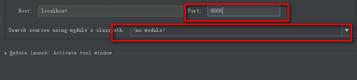

# tomcat debug模式启动设置

windows：进入到%CATALINA_HOME%/bin目录，运行命令：catalina jpda start，此时开启tomcat调试功能，默认调试端口8000。

可在IDE设置远程调试，IntelliJ设置如下：

Run → Edit Configurations...→ + → Remote，设置端口号，以及待调试的代码模块，即可启动代码远程调试。

ps: tomcat默认调试端口为8000，可以通过设置环境变量JPDA_ADDRESS来修改端口号，另外默认jvm启动是没有挂起的，

可通过设置环境变量JPDA_SUSPEND为y使tomcat的jvm挂起，方便应用启动初始化的代码调试。  catalina.bat将会读取这两个环境变量覆盖默认配置。

ps: windows下可直接修改catalina.bat文件设置jpda运行，但不建议这么干，这是侵入式设置，另外想要正常模式运行tomcat变得麻烦。
