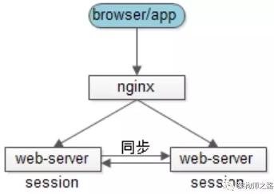
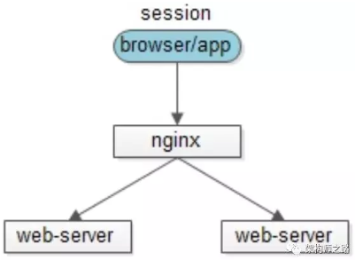
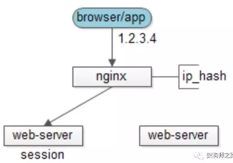
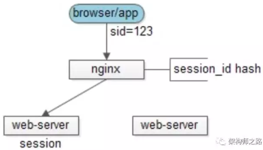

# 分布式session
## session
服务器为每个用户创建一个会话，存储用户的相关信息，以便多次请求能够定位到同一个上下文。这样，当用户在应用程序的 Web 页之间跳转时，存储在 Session 对象中的变量将不会丢失，而是在整个用户会话中一直存在下去。当用户请求来自应用程序的 Web 页时，如果该用户还没有会话，则 Web 服务器将自动创建一个 Session 对象。当会话过期或被放弃后，服务器将终止该会话。

Web开发中，web-server可以自动为同一个浏览器的访问用户自动创建session，提供数据存储功能。最常见的，会把用户的登录信息、用户信息存储在session中，以保持登录状态。

只要用户不重启浏览器，每次http短连接请求，理论上服务端都能定位到session，保持会话。

## 分布式session
单服务器web应用中，session信息只需存在该服务器中，这是我们前几年最常接触的方式，但是近几年随着分布式系统的流行，单系统已经不能满足日益增长的百万级用户的需求，集群方式部署服务器已在很多公司运用起来，当高并发量的请求到达服务端的时候通过负载均衡的方式分发到集群中的某个服务器，这样就有可能导致同一个用户的多次请求被分发到集群的不同服务器上，就会出现取不到session数据的情况，于是session的共享就成了一个问题。


如上图，假设用户包含登录信息的session都记录在第一台web-server上，反向代理如果将请求路由到另一台web-server上，可能就找不到相关信息，而导致用户需要重新登录。

## session一致性解决方案

### 1. session复制(同步)


**思路：**`多个web-server之间相互同步session，这样每个web-server之间都包含全部的session`

**优点：**`web-server支持的功能，应用程序不需要修改代码`

**不足:**
```
* session的同步需要数据传输，占内网带宽，有时延
* 所有web-server都包含所有session数据，数据量受内存限制，无法水平扩展
* 有更多web-server时要歇菜
```

### 2. 客户端存储法


**思路：**`服务端存储所有用户的session，内存占用较大，可以将session存储到浏览器cookie中，每个端只要存储一个用户的数据了`

**优点：**`服务端不需要存储`

**缺点：**
```
* 每次http请求都携带session，占外网带宽
* 数据存储在端上，并在网络传输，存在泄漏、篡改、窃取等安全隐患
* session存储的数据大小受cookie限制
“端存储”的方案虽然不常用，但确实是一种思路
```

### 3. 反向代理hash一致性
**思路：**`web-server为了保证高可用，有多台冗余，反向代理层能不能做一些事情，让同一个用户的请求保证落在一台web-server上呢？`

#### 方案一：四层代理hash
反向代理层使用用户ip来做hash，以保证同一个ip的请求落在同一个web-server上


#### 方案二：七层代理hash
反向代理使用http协议中的某些业务属性来做hash，例如sid，city_id，user_id等，能够更加灵活的实施hash策略，以保证同一个浏览器用户的请求落在同一个web-server上



**优点：**
```
* 只需要改nginx配置，不需要修改应用代码
* 负载均衡，只要hash属性是均匀的，多台web-server的负载是均衡的
* 可以支持web-server水平扩展（session同步法是不行的，受内存限制）
```

**不足：**
```
* 如果web-server重启，一部分session会丢失，产生业务影响，例如部分用户重新登录
* 如果web-server水平扩展，rehash后session重新分布，也会有一部分用户路由不到正确的session
```
session一般是有有效期的，所有不足中的两点，可以认为等同于部分session失效，一般问题不大。
对于四层hash还是七层hash，个人推荐前者：让专业的软件做专业的事情，反向代理就负责转发，尽量不要引入应用层业务属性，除非不得不这么做（例如，有时候多机房多活需要按照业务属性路由到不同机房的web-server）。

### 4. 后端统一集中存储


**思路：**`将session存储在web-server后端的存储层，数据库或者缓存`

**优点：**
```
* 没有安全隐患
* 可以水平扩展，数据库/缓存水平切分即可
* web-server重启或者扩容都不会有session丢失
```
**不足：**`增加了一次网络调用，并且需要修改应用代码`

对于db存储还是cache，个人推荐后者：session读取的频率会很高，数据库压力会比较大。如果有session高可用需求，cache可以做高可用，但大部分情况下session可以丢失，一般也不需要考虑高可用。

## 总结
保证session一致性的架构设计常见方法：
```
* session同步法：多台web-server相互同步数据
* 客户端存储法：一个用户只存储自己的数据
* 反向代理hash一致性：四层hash和七层hash都可以做，保证一个用户的请求落在一台web-server上
* 后端统一存储：web-server重启和扩容，session也不会丢失
```

对于方案3和方案4，个人建议推荐后者：
```
* web层、service层无状态是大规模分布式系统设计原则之一，session属于状态，不宜放在web层
* 让专业的软件做专业的事情，web-server存session？还是让cache去做这样的事情吧。
```
##### 附录
[原文 https://www.cnblogs.com/study-everyday/p/7853145.html](https://www.cnblogs.com/study-everyday/p/7853145.html)
