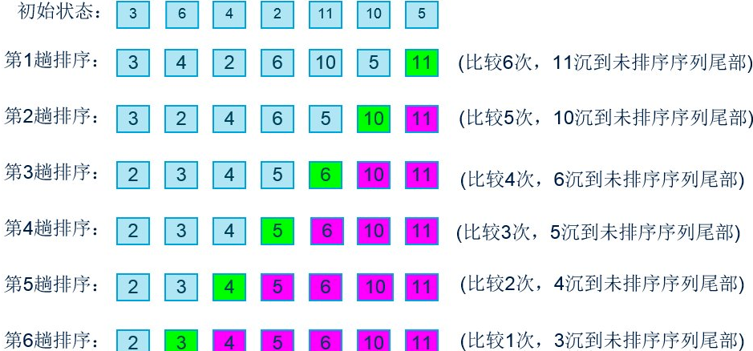

# 冒泡排序
**算法思想：**`每次将一个数组元素依次和右边相邻元素作比较并交换，一趟排序将会固定一个元素至最右边，也是该元素的最终排序位置。`

排序过程示意图：


简单实现：
```java
public void bubbleSort(int[] array) {
  for (int i = array.length - 1; i > 0; --i) { // 外层循环控制排序趟数
    for (int j = 0; j < i; ++j) {
      if (array[j] > array[j + 1]) { // 升序排序
        int temp = array[j + 1];
        array[j + 1] = array[j];
        array[j] = temp;
      }
    }
  }
}
```
**可以优化：**

`如果某一趟排序过程中，一次交换操作都没有，这意味着数组已经是有序数组了，因此此时可以终止循环，不在往下执行。`
