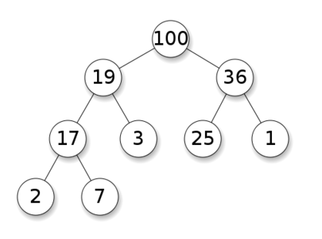
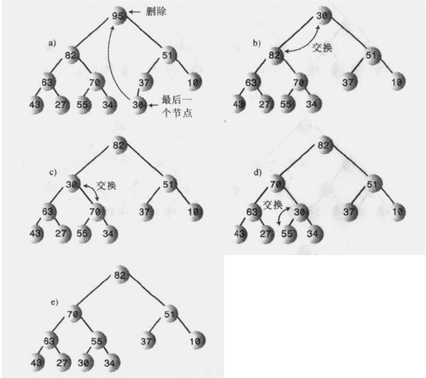
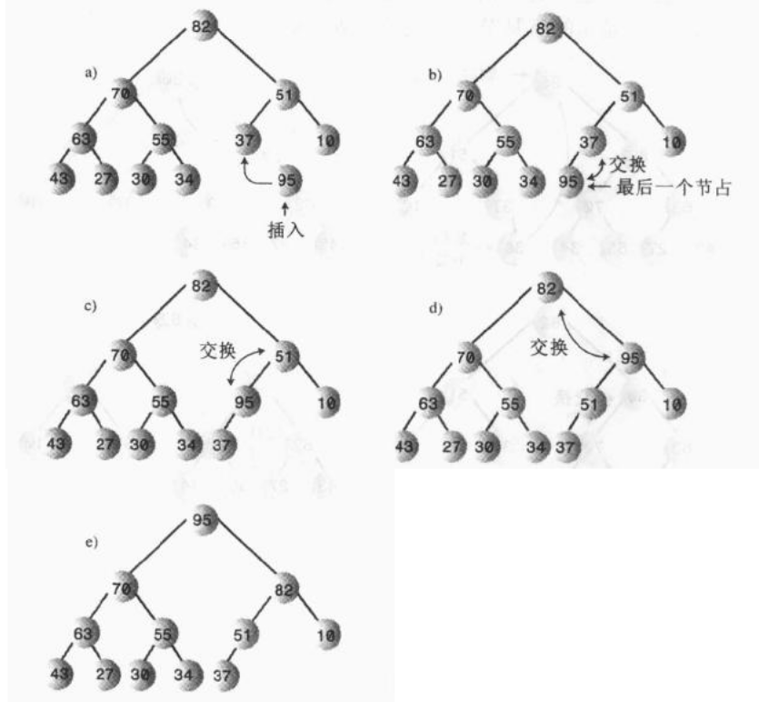

# 什么是堆
堆是有如下特点的二叉树：
* 是一颗完全二叉树。
* 通常用数组实现。
* 堆中每一个节点的关键字都大于（或等于）这个节点的子节点的关键字。（最大堆）


由于堆是完全二叉树，因此用数组实现时，从下标0到N-1，每一个数据单元都有数据项。
最大堆可以实现降序的优先级队列。
# 优先级队列、堆和抽象数据类型（ADT）
堆基本方法：
```java
class Heap {
  private Node heapArray[];
  public void insert(Node node) {}
  public Node remove() {}
}
```
优先级队列基本方法：
```java
class PriorityQueue {
  private Heap theHeap;
  public void insert(Node node) { theHeap.insert(node) }
  public Node remove() { return theHeap.remove() }
}
```
# 弱序
堆的数据结构特点决定了堆相对二叉搜索树来说是弱序的，二叉搜索树很容易实现查找关键字、删除关键字以及顺序遍历等操作，但在堆中，堆只保证从根到叶子节点的每一条路径上的节点是顺序排列的，路径之间是相互独立的，
因此不支持遍历操作，且删除关键字操作也只能通过顺序查找数组单元来执行，时间复杂度为O(N)。虽然堆数据接近无序，但是堆完全可以实现移除最大节点、快速插入新节点操作，因此可以作为优先级队列的底层实现方式之一。
#移除操作
最大堆移除操作指移除堆中关键字最大的节点即根节点。

**移除关键步骤：**
```
1.移除根节点
2.将最后一个节点置为根节点
3.调节结构：一直向下筛选这个节点，直到它在一个大于它的节点之下，小于它的节点之上为止。
```
移除操作过程如图所示：

可以知晓，每次向下筛选节点时，都应该取左右子节点中最大的一个进行交换。另外一点值得注意的是，在向下筛选过程中，一次交换会进行三次复制，这可以进行优化，将待寻找正确位置的节点保存在temp临时变量里，然后找
到正确位置后，在直接将节点复制过去，这在堆层次较深的时候，可以节省大量的复制操作。
# 插入操作
插入操作则使用向上筛选。节点初始时插入到数组最后一个空着的位置，数组容量增一：
```java
heapArray[N] = newNode;
++N;
```
随后进行向上筛选以调节结构满足堆结构规则，相对向下筛序较为简单，因为其只要和父节点进行交换即可，如图所示:
